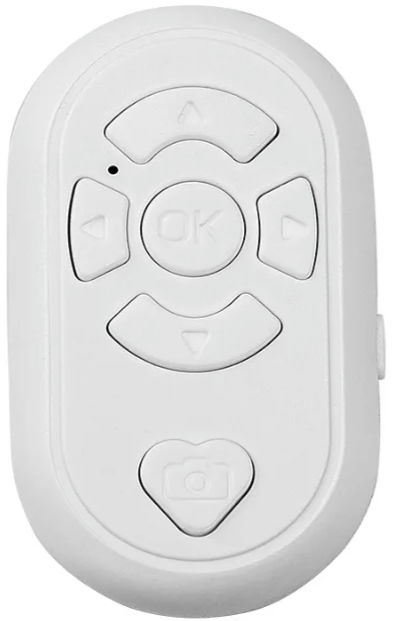

# BLE-M3 Android Interceptor

This project, **BLE-M3**, is a fork of the original [Beauty-R1](https://github.com/olivluca/bluetooth-tiktok-remote). It provides a solution for intercepting input events from a BLE (Bluetooth Low Energy) clicker device and injecting keypresses on Android devices. The program is designed to work with devices that emulate mouse input but need to be repurposed for keyboard-like functionality.

[](./BLE-M3.jpg)

## Overview

The **BLE-M3 Android Interceptor** is a C program that listens to input events from a BLE clicker device and translates them into keypress events. It is intended to run on an Android device via an `adb shell` session, as it requires access to `/dev/input/eventX` devices. The program uses the `input keyevent X` command to inject keypresses into the system.

## Features

- Intercepts input events from BLE clicker devices.
- Translates mouse-like input into keypress events.
- Can run in debug mode to display all received events.
- Designed for use on Android devices with `adb` access.

## Compilation

A pre-compiled binary for ARM devices is available in the [releases page](../../releases).

### Quick Start

```bash
# Build all ARM architectures
just all

# Build specific ARM architecture
just armv7
just armhf

# Build for local development/testing (x86_64)
just dev
```

For detailed build instructions and troubleshooting, see [BUILD.md](BUILD.md).

## Deployment

Once compiled, the binary can be deployed to the Android device using adb:

```bash
adb push build/BLE-M3-armv7 /data/local/tmp/BLE-M3
```

## Usage

You can run the program on the Android device via adb shell in three modes:

```bash
# Default mode - uses input keyevent for sending keypresses
/data/local/tmp/BLE-M3

# Event mode - uses am broadcast events instead of keyevents (com.BLE-M3.UP/DOWN/LEFT/RIGHT/PHOTO/ENTER)
/data/local/tmp/BLE-M3 am

# Debug mode - prints all received events
/data/local/tmp/BLE-M3 debug
```

## Automation
To avoid maintaining an active adb connection, you can use the Automate or Tasker to create a macro. The macro can execute the program using the ADB shell command once it detects that the BLE-M3 has been connected.
